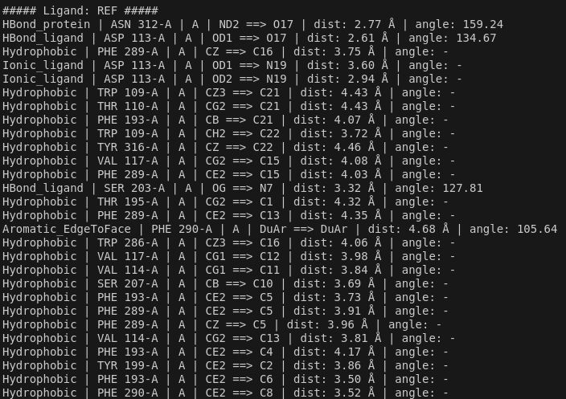

# Python API - Quickstart

This page contains minimal working examples to:
- list interactions
- compute fingerprints
- compute Tanimoto scores

---
## API functions 
### 1) List interactions

```python
import ichem_ifp


def main():
    # Config
    cfg = ichem_ifp.IFPConfig() # cfg config object
    cfg.basic = True  # Enable the basic IFP profile

    protein = "site.mol2"
    ligand = "ligand.mol2"  # Can be either single MOL2 or multi-MOL2

    # Compute interactions
    try:
        results = ichem_ifp.compute_ifp_interactions(protein, ligand, cfg)
    except Exception as e:
        print(f"Error while computing interactions: {e}")
        return

    # Displaying results
    for lig in results:
        print(f"\n##### Ligand: {lig.ligand_name} #####")

        for it in lig.interactions:
            angle_str = f"{it.angle:.2f}" if it.angle is not None else "-"

            print(
                f"{it.type_interaction} | "
                f"{it.residue_identifier} | "
                f"{it.chain} | "
                f"{it.atom_prot} ==> {it.atom_lig} | "
                f"dist: {it.distance:.2f} Å | "
                f"angle: {angle_str}"
            )

if __name__ == "__main__":
    main()

```
#### Output



### 2) Fingerprints

```python
import ichem_ifp

cfg = ichem_ifp.IFPConfig()
cfg.basic = True

fps = ichem_ifp.compute_ifp_fingerprints("site.mol2", "ligands.mol2", cfg)

for fp in fps:
    print("Ligand:", fp.ligand_name)
    print("Residues layout:", fp.residues)
    print("Bitstring:", fp.bitstring)
```

### 3) Tanimoto (ligands vs references, same protein)


```python
import ichem_ifp

cfg = ichem_ifp.IFPConfig()
cfg.basic = True

protein   = "site.mol2"
dockeds   = "dockeds.mol2"  # one or many ligands (multi-MOL2 supported)
refs      = "refs.mol2"     # one or many reference ligands

scores = ichem_ifp.compute_ifp_tanimoto(protein, dockeds, refs, cfg)

for s in scores:
    print(f"{s.reference}\t{s.ligand}\t{s.tanimoto:.3f}")
```

### 4) Tanimoto between two ensembles


```python
import ichem_ifp

cfg = ichem_ifp.IFPConfig()
cfg.basic = True

scores = ichem_ifp.compute_ifp_tanimoto_ensembles(
    "site1.mol2", "ligands1.mol2",
    "site2.mol2", "ligands2.mol2",
    cfg
)

for s in scores:
    print(f"{s.reference}\t{s.ligand}\t{s.tanimoto:.3f}")
```

---

## Notes

!!! note "Multi-MOL2 ligands"
    Multi-MOL2 is supported for ligands

!!! warning "Fingerprint compatibility"
    Fingerprints are site-dependent: `fp.residues` defines the fingerprint layout
    Compare fingerprints only when using compatible residue layouts

!!! note "Angle field"
    `InteractionRecord.angle` can be `None`
    It is computed for H-bonds, aromatic and pi-cation interactions


