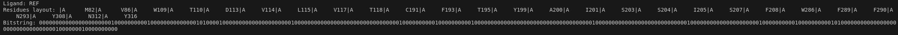
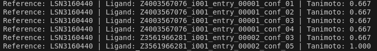
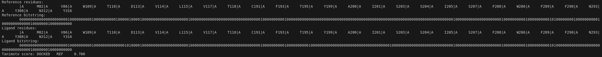

# Python API - Quickstart

This page contains minimal working examples to:
- list interactions
- compute fingerprints
- compute Tanimoto scores

---
## API functions 
### 1) List interactions

```python
import ichem_ifp


def main():
    # Config
    cfg = ichem_ifp.IFPConfig() # cfg config object
    cfg.basic = True  # Enable the basic IFP profile

    protein = "site.mol2"
    ligand = "ligand.mol2"  # Can be either single MOL2 or multi-MOL2

    # Compute interactions
    try:
        results = ichem_ifp.compute_ifp_interactions(protein, ligand, cfg)
    except Exception as e:
        print(f"Error while computing interactions: {e}")
        return

    # Displaying results
    for lig in results:
        print(f"\n##### Ligand: {lig.ligand_name} #####")

        for it in lig.interactions:
            angle_str = f"{it.angle:.2f}" if it.angle is not None else "-"

            print(
                f"{it.type_interaction} | "
                f"{it.residue_identifier} | "
                f"{it.chain} | "
                f"{it.atom_prot} ==> {it.atom_lig} | "
                f"dist: {it.distance:.2f} Å | "
                f"angle: {angle_str}"
            )

if __name__ == "__main__":
    main()

```
#### Output interactions:


### 2) Fingerprints

```python
import ichem_ifp

def main():
    # Config
    cfg = ichem_ifp.IFPConfig()
    cfg.basic = True

    # # Compute fingerprints
    try:
        fps = ichem_ifp.compute_ifp_fingerprints("site.mol2", "ligand.mol2", cfg)
    except Exception as e:
        print(f"Error computing fingerprints: {e}")
        return

    # Displaying results
    if not fps:
        print("No fingerprints were computed")
        return

    for fp in fps:
        print(f"Ligand: {fp.ligand_name}")
        print(f"Residues layout: {fp.residues}")
        print(f"Bitstring: {fp.bitstring}\n")


if __name__ == "__main__":
    main()
```

#### Output fingerprint:


### 3) Tanimoto (ligands vs references, same protein)


```python
import ichem_ifp

def main():
    # Config
    cfg = ichem_ifp.IFPConfig()
    cfg.basic = True

    protein = "teo/Tyr145_prot.mol2"
    dockeds = "teo/aromatic.mol2" # Single or multi-ligand MOL2
    refs = "teo/LSN_ref.mol2" # Reference ligand, it can be single or multi-ligand MOL2

    # Compute Tanimoto similarity scores
    try:
        scores = ichem_ifp.compute_ifp_tanimoto(protein, dockeds, refs, cfg)
    except Exception as e:
        print(f"Error computing Tanimoto scores: {e}")
        return

    if not scores:
        print("No Tanimoto scores were computed")
        return

    # Displaying results
    for s in scores:
        print(f"Reference: {s.reference} | Ligand: {s.ligand} | Tanimoto: {s.tanimoto:.3f}")


if __name__ == "__main__":
    main()
```

#### Output tanimoto:


### 4) Tanimoto between two ensembles


```python
import ichem_ifp

def main():
    # Config
    config = ichem_ifp.IFPConfig()
    config.basic = True

    # Ensemble input files
    protein1 = "site.mol2"
    ligands1 = "ligand1.mol2"

    protein2 = "site.mol2"
    ligands2 = "ligand2.mol2"

    # Compute Tanimoto similarity scores between ensembles
    try:
        scores = ichem_ifp.compute_ifp_tanimoto_ensembles(
            protein1,
            ligands1,
            protein2,
            ligands2,
            config,
        )
    except Exception as e:
        print(f"Error computing ensemble Tanimoto scores: {e}")
        return

    if not scores:
        print("No ensemble Tanimoto scores were computed")
        return

    # Displaying results
    for s in scores:
        # Reference (ensemble 2)
        print("Reference residues:")
        print(f"\t{s.reference_residues}")
        print("Reference bitstring:")
        print(f"\t{s.reference_bitstring}")

        # Docked (ensemble 1)
        print("Ligand residues:")
        print(f"\t{s.ligand_residues}")
        print("Ligand bitstring:")
        print(f"\t{s.ligand_bitstring}")

        # Tanimoto
        print(f"Tanimoto score: {s.reference} \t {s.ligand} \t {s.tanimoto:.3f}")
        print()

if __name__ == "__main__":
    main()
```
#### Output tanimoto ensembles:


---

## Notes

!!! note "Multi-MOL2 ligands"
    Multi-MOL2 is supported for ligands

!!! warning "Fingerprint compatibility"
    Fingerprints are site-dependent: `fp.residues` defines the fingerprint layout
    Compare fingerprints only when using compatible residue layouts

!!! note "Angle field"
    `InteractionRecord.angle` can be `None`
    It is computed for H-bonds, aromatic and pi-cation interactions


